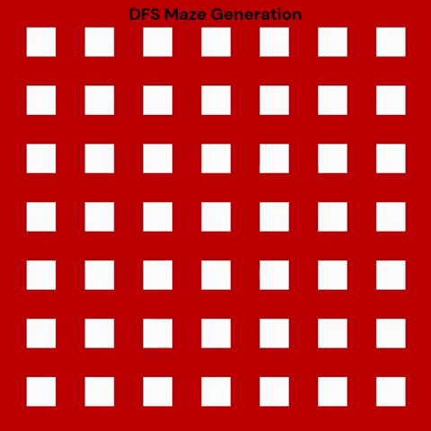
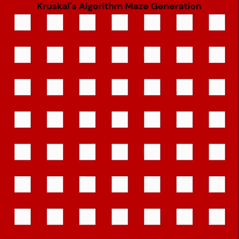
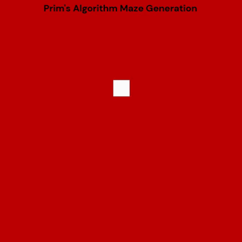

# Maze 
This repository is about the problem of generating and solving mazes. We will use some classic algorithms (e.g., DFS) and also explore Deep Q-Learning techniques.

## Table of contents
- [Introduction](#introduction)
- [Maze Generation Algorithms](#maze-generation-algorithms)
- [Maze Solving Algorithms](#maze-solving-algorithms)
- [Installation](#installation)
- [Usage](#usage)
- [License](#license)

## Introduction

  
  I created this repository with the goal of writing my first scientific article.  
  I want to explore the topic of mazes: how do we generate them?  
  What does it take to solve one?  

  I’ve always been bad at solving mazes myself — that’s exactly why I want to design computer algorithms that can do it for me.  

  We’ll learn how to generate mazes following ideas from <a href="https://en.wikipedia.org/wiki/Maze_generation_algorithm">Wikipedia</a>.  
  Since these algorithms are rooted in graph theory, having some background in it will be helpful.  

  In this repository, you’ll find two very different approaches to solving mazes:  
  - **Dijkstra’s algorithm**, a classic graph-based method  
  - **Deep Q-learning**, a reinforcement learning approach  

  It’s important to note that while both methods are interesting, **Dijkstra’s algorithm is the preferred solution** for this problem!

## Maze Generation Algorithms
A maze can be generated based on the predetermined arrangement of cells with walls between them. The predetermined arrangement can be represented as the graph. The nodes are cells and walls are edges.

### Depth-first search (DFS)

  
   
  1. Start with large grid of cells starting with four walls. 
   
   
  2. Select starting cell, then visit randomly chosen neighbouring cell that hasn't been visited yet. 
   
   
  3. The process is repeated until you visit all of your neigbours.

 
 
 

### Kruskal's algorithm

  
   
  1. Start with large grid of cells starting with four walls. Create a list of walls and a set for each cell, each containing just that one cell. 
   
   
  2. For each wall, in some random order apply following logic:
  if cells separated by wall are in disjointed sets then merge them and remove the current wall.
   
   
  3. For set logic apply <a href="https://www.youtube.com/watch?v=ayW5B2W9hfo">Union Find</a> algorithm.

 

### Prim's algorithm

  
  1. Start with grid full of walls.
   
   
  2. Select a cell and mark it as the part of the maze. Add the pair of walls and neighbouring cells to the wall list.
   
   
  3. While the wall list isn't empty, choose a random pair from the list.
   
   
  4. If cell from the pair wasn't visited, then mark wall and cell as the part of the maze. 
   
  Now add the pair of walls and neigbouring cells to the wall list.

 

## Maze Solving Algorithms
...

## Installation
...

## Usage
...

## License
This project is licensed under the MIT License. See the LICENSE file for details.