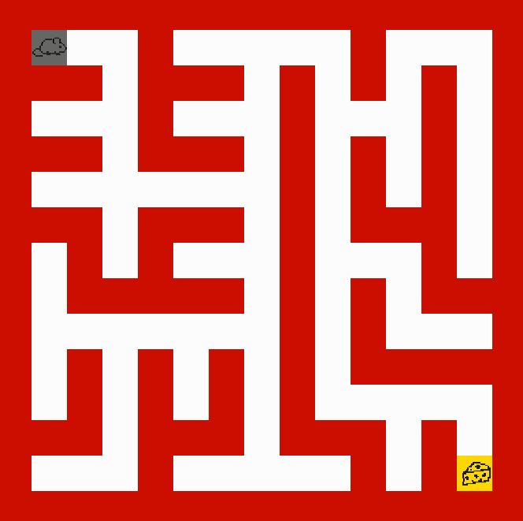

# Maze 
This repository is about the problem of generating and solving mazes. We will use some classic algorithms (e.g., DFS) and also explore Deep Q-Learning techniques.

## Table of contents
- [Introduction](#introduction)
- [Maze Generation Algorithms](#maze-generation-algorithms)
- [Maze Solving Algorithms](#maze-solving-algorithms)
- [Installation](#installation)
- [Usage](#usage)
- [License](#license)

## Introduction

  
  I created this repository with the goal of writing my first scientific article.  
  I want to explore the topic of mazes: how do we generate them?  
  What does it take to solve one?  

  I’ve always been bad at solving mazes myself — that’s exactly why I want to design computer algorithms that can do it for me.  

  We’ll learn how to generate mazes following ideas from <a href="https://en.wikipedia.org/wiki/Maze_generation_algorithm">Wikipedia</a>.  
  Since these algorithms are rooted in graph theory, having some background in it will be helpful.  

  In this repository, you’ll find two very different approaches to solving mazes:  
  - **Dijkstra’s algorithm**, a classic graph-based method  
  - **Deep Q-learning**, a reinforcement learning approach  

  It’s important to note that while both methods are interesting, **Dijkstra’s algorithm is the preferred solution** for this problem!

## Maze Generation Algorithms
A maze can be generated based on the predetermined arrangement of cells with walls between them. The predetermined arrangement can be represented as the graph. The nodes are cells and walls are edges.

### Depth-first search (DFS)

  
  1. Start with large grid of cells starting with four walls. 
   
   
  2. Select starting cell, then visit randomly chosen neighbouring cell that hasn't been visited yet. 
   
   
  3. The process is repeated until you visit all of your neigbours.

 
 
 

### Kruskal's algorithm

  
  1. Start with large grid of cells starting with four walls. Create a list of walls and a set for each cell, each containing just that one cell. 
   
   
  2. For each wall, in some random order apply following logic:
  if cells separated by wall are in disjointed sets then merge them and remove the current wall.
   
   
  3. For set logic apply <a href="https://www.youtube.com/watch?v=ayW5B2W9hfo">Union Find</a> algorithm.

 

### Prim's algorithm

  
  1. Start with grid full of walls.
   
   
  2. Select a cell and mark it as the part of the maze. Add the pair of walls and neighbouring cells to the wall list.
   
   
  3. While the wall list isn't empty, choose a random pair from the list.
   
   
  4. If cell from the pair wasn't visited, then mark wall and cell as the part of the maze. 
   
  Now add the pair of walls and neigbouring cells to the wall list.

 

## Maze Solving Algorithms
Maze problem can be interpreted as the graph problem or current state analysis. Both ways are correct and we will foucs on how to execute them.

### Dijkstra's algorithm

  
  1. Initialize two arrays (visited, distances) and the stack for processing nodes.
   
   
  2. Choose target node (cheese location), set its distance to 0 and push onto the stack.
   
   
  3. While the stack isn't empty, pull the node and anlyze its edges and update distances array. 
   
   
  4. After processing the edges, put onto the stack nearby nodes that haven't been visited yet.

 

### A* algorithm
A* uses a **best-first search** approach, combining:

- **Cost so far (`g(n)`)**: The actual cost to reach a node from the start.
- **Estimated cost to goal (`h(n)`)**: A heuristic estimate of the remaining distance to the goal. The choice of heuristic greatly impacts A*'s performance:
  - **Manhattan distance**: Used for 4-directional grid movement.
  - **Euclidean distance**: Used when diagonal movement is allowed.
  - **Chebyshev distance**: Used for 8-directional grid movement.

It prioritizes nodes based on the evaluation function:

$$
f(n) = g(n) + h(n)
$$

Where:
- **g(n)** is the cost from the start node to node `n`.
- **h(n)** is the estimated cost from node `n` to the goal.
- **f(n)** is the total estimated cost of the path through `n`.

### Q-Learning
Q-Learning is a value-based reinforcement learning algorithm used to find the optimal action-selection policy for an agent interacting with an environment.

The algorithm maintains a Q-table, where each entry *Q(s, a)* represents the expected value of taking action *a* in state *s*. Over time, the agent updates this table to improve its decisions.

The Q-value is updated using the formula:

$$
Q(s, a) \leftarrow Q(s, a) + \alpha \Big[ R + \gamma \max_{a'} Q(s', a')\Big]
$$

Where:
- **$Q(s, a)$** – Current Q-value for state $s$ and action $a$.
- **$\alpha$ (alpha)** – Learning rate, determining how much new information overrides old information.
- **$R$** – Immediate reward received for taking action $a$ in state $s$.
- **$\gamma$ (gamma)** – Discount factor, controlling the importance of future rewards.
- **$\max_{a'} Q(s', a')$** – Maximum Q-value for the next state $s'$, representing the best possible future reward.

## Installation
...

## Usage
...

## License
This project is licensed under the MIT License. See the LICENSE file for details.